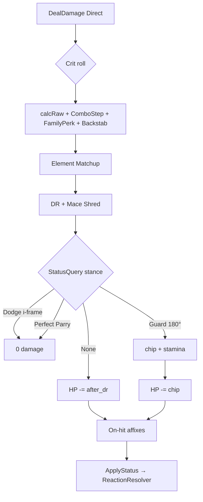

# Combat & Hasar Pipeline — Roblox Mimari Plan (F1)

> **Referans:** `COMBAT_STAT_SHEET.md` §11 · `STATUS_SYSTEM.md` §6 · `CHEMISTRY_ENGINE.md` §5.4 · `GDD.md` §6.1–§17  
> **Durum:** Combat alpha — sunucu otoriteli pipeline **implemente** (`src/server/Combat/`, `src/shared/Combat/`).

---

## 1. İlkeler

| İlke | Açıklama |
|------|----------|
| **Server authoritative** | Hasar, status, stamina, HP yalnızca sunucuda |
| **Tek pipeline** | Direct, yetenek, chip aynı `DamageService` sırasından geçer |
| **Tek status girişi** | Her etki `StatusService.ApplyStatus` |
| **Data-driven** | Status, silah, reaksiyon tabloları ModuleScript / tablo |
| **Query, not flag** | `if parrying` yerine `StatusQuery.HasStance` |

---

## 2. Klasör yapısı (öneri)

```
ReplicatedStorage/
└── Combat/
    ├── Config/
    │   ├── CombatConstants.lua      -- k_*, cap, stamina maliyetleri
    │   └── DamageKinds.lua          -- Direct, DoT, Burst, Environmental, Execute
    ├── Definitions/
    │   ├── StatusRegistry.lua
    │   ├── ReactionTable.lua        -- R1–R10
    │   ├── ElementMatchup.lua
    │   ├── WeaponDefs.lua           -- base, tier, scaling, perks
    │   └── AbilityDefs.lua
    └── Shared/
        ├── StatAggregator.lua       -- loadout → secondary stats
        ├── DamagePipeline.lua       -- saf fonksiyonlar (test edilebilir)
        ├── SynergyResolver.lua      -- Pure/Harmony/Unbound/Duality
        └── CombatTypes.lua          -- DamageContext, HitResult

ServerScriptService/
└── Combat/
    ├── CombatService.lua            -- maç içi combat state orchestrator
    ├── DamageService.lua            -- DealDamage tek giriş
    ├── StatusService.lua            -- ApplyStatus + tick loop
    ├── ReactionResolver.lua         -- CHEMISTRY §5.4
    ├── StaminaService.lua
    ├── GuardService.lua
    ├── DodgeService.lua
    ├── ParryService.lua             -- stub MVP sonrası
    ├── HitboxService.lua            -- melee overlap
    ├── ProjectileService.lua        -- bow/staff LA
    ├── ComboTracker.lua             -- L1→L2→L3 sayaç, 0.6s window
    ├── MeasuredStrikeTracker.lua    -- kılıç L3 FamilyPerk (ComboTracker üzerinde)
    ├── CombatReplication.lua        -- RemoteEvent payload'ları
    └── EnvironmentDamageService.lua -- gaz, boss hazard, aura

StarterPlayer/
└── Combat/
    ├── CombatInputController.lua    -- input → intent
    ├── CombatAnimationController.lua
    └── CombatFXController.lua       -- VFX/SFX (client only)

ServerStorage/ (veya DataStore katmanı)
└── PlayerCombatProfile.lua          -- level, stats, loadout snapshot
```

---

## 3. Modül sorumlulukları

### 3.1 `StatAggregator` (Shared)

**Girdi:** level, primary dağılımı, gear snapshot, sinerji bandı  
**Çıktı:** `CombatStats` — HP, Stamina, Defence, DR%, Resist, Damage mult, Crit, Potency, …

```
Resolve(playerId) → CombatStats
OnLoadoutChange → invalidate cache
```

Sinerji stat modları burada uygulanır:
- Unbound: +5% direct mult, +10% Defence, +12% Resist
- Harmony: +15 flat Status Potency
- Duality: +5% Defence, +5% Resist

### 3.2 `DamagePipeline` (Shared — saf, unit-test friendly)

Tek fonksiyon zinciri; yan etki **yok**:

```lua
-- Örnek imza
function DamagePipeline.ResolveDirect(ctx: DamageContext): DamageResult
```

| Adım | Fonksiyon | Not |
|------|-----------|-----|
| 1 | `rollCrit(ctx)` | LA + direct burst yetenek |
| 2 | `calcRaw(ctx)` | WeaponBase × scaling × gear% × sinerji direct% |
| 3 | `applyMatchup(raw, atkElement, defChestElement)` | ±15% |
| 4 | `applyDR(after_matchup, defenderStats, shred%)` | Mace perk |
| 5 | `resolveStance(after_dr, defender)` | Dodge → Parry → Guard |
| 6 | `calcChipIfGuard(...)` | after_dr × chip% |
| 7 | → `DamageResult { hpDamage, chipDamage, staminaCost, blocked, stance }` |

**DoT / Burst kanalı** ayrı:

```lua
DamagePipeline.ResolveDoTTick(ctx)
DamagePipeline.ResolveBurst(ctx)   -- Vaporize, Cauterize burst
```

### 3.3 `DamageService` (Server)

**Tek giriş noktası** — tüm hasar kaynakları buraya gelir:

```lua
DamageService.DealDamage(context: DamageContext): HitResult
```

```lua
DamageContext = {
  kind          = "Direct" | "DoT" | "Burst" | "Environmental" | "Execute",
  attacker      = Entity?,
  defender      = Entity,
  sourceId      = string,       -- "LightAttack", "Staff_Firebolt", "GasZone"
  weaponDefId   = string?,
  abilityDefId  = string?,
  hitIndex      = number?,        -- multi-hit: yalnızca 1. crit
  hitDirection  = Vector3?,       -- guard 180°, backstab
  baseDamage    = number?,        -- yetenek override
  skipOnHit     = boolean,        -- dodge/parry sonrası
}
```

**Akış:**

```
DealDamage(ctx)
  if ctx.kind == "Execute" → defender.HP = 0; return
  if ctx.kind == "Environmental" → apply flat DPS; DR yok; return
  if ctx.kind == "DoT" | "Burst" → pipeline DoT/Burst; apply HP; return

  -- Direct:
  stats = StatAggregator.Resolve(attacker)
  result = DamagePipeline.ResolveDirect(ctx, stats)
  if result.blocked (dodge/parry) → return
  apply HP damage (result.hpDamage or chip)
  if result.staminaCost → StaminaService.Spend(defender, ...)
  if not skipOnHit → OnHitAffixes(attacker, defender)
  -- ComboStep (L2/L3), FamilyPerk (L3), backstab — raw adımında
```

### 3.4 `StatusService` (Server)

`STATUS_SYSTEM.md` §6.1 ile birebir:

```
ApplyStatus(target, id, ctx)
  → immunity check
  → CalcDuration (Potency / Resist)
  → append + order index (FIFO kaydı)
  → batch queue'ya ekle (reaksiyon burası değil)
  → VFX replicate

OnTickEnd / Heartbeat end:
  → ReactionResolver.ResolveBatch(target)  -- CHEMISTRY §5.4
```

Tick loop (0.1s veya Heartbeat): DoT tick → `DamageService.DealDamage(kind=DoT)`; ardından pending status batch'leri `ResolveBatch`.

### 3.5 `ReactionResolver` (Server)

`CHEMISTRY_ENGINE.md` §5.4 — **tick sonu batch**; çakışmada FIFO.

```
ResolveBatch(target)
  batch = statuses added this tick (application order)
  pool  = existing statuses on target + batch
  while true:
    pair = first valid reaction by FIFO (earliest ApplyStatus that completes a pair)
    if no pair → break
    remove both inputs
    apply burst (DamageService kind=Burst)
    apply output status if any
    handle chain (R2, R8) → ApplyStatus per nearby Wet target (kendi batch sırası)
```

*Eski `TryResolve` anlık çağrı modeli kaldırıldı — batch + FIFO tek kaynak.*
### 3.6 Combat aksiyon modülleri

| Modül | Sorumluluk |
|-------|------------|
| `CombatInputController` | Client: LA, dodge, guard, sprint intent |
| `CombatService` | Server: intent validate, cooldown, silah state |
| `HitboxService` | Melee overlap (~6 stud); server raycast / GetPartBounds |
| `ProjectileService` | Bow/Staff projectile; server sim, hit → DealDamage |
| `DodgeService` | i-frame stance, invulnerable via StatusQuery |
| `GuardService` | shield tipi, 180° check, chip pipeline |
| `StaminaService` | spend, regen, guard break tetik |
| `ComboTracker` | silahId → combo step (L1/L2/L3), 0.6s window; hit veya guard block ilerletir |
| `MeasuredStrikeTracker` | kılıç L3 FamilyPerk flag (ComboTracker L3 ile; hedef başına sayaç yok) |
| `EnvironmentDamageService` | PvP gaz, boss aura, Monolith telegraph |

### 3.7 Replikasyon (özet)

| Olay | Yön | Payload |
|------|-----|---------|
| `CombatIntent` | C→S | action, timestamp, lookVector |
| `DamageEvent` | S→All | defender, amount, kind, blocked |
| `StatusApplied` | S→All | target, statusId, duration |
| `ReactionEvent` | S→All | reactionId, position (VFX) |

Client **tahmin yapmaz** (LA anim lokal); hasar sayısı sunucudan gelir.

---

## 4. Hasar pipeline — kod eşlemesi

`COMBAT_STAT_SHEET.md` §11.1:

```
1. Crit roll
2. raw
3. after_matchup
4. after_dr
5. Defensive stance (Dodge → Parry → Guard)
6. HP (+ chip ayrı kanal)
7. On-hit status
8. ReactionResolver
```



---

## 5. F1 implementasyon sırası

| Sıra | Modül | Test |
|------|-------|------|
| **1** | `CombatConstants` + `StatAggregator` | Stat sheet örnek build |
| **2** | `DamagePipeline` (saf) | Unit test: DR, matchup, crit |
| **3** | `DamageService` + HP | Training dummy |
| **4** | `StatusService` + Registry | Wet, Ignite, Slow |
| **5** | `ReactionResolver` | R1 Vaporize, R2 chain |
| **6** | `HitboxService` + LA | Sword melee |
| **7** | `DodgeService` + `GuardService` + Stamina | Chip, break |
| **8** | `ProjectileService` | Staff/Bow |
| **9** | `ComboTracker` + `MeasuredStrikeTracker` | L1–L3 + kılıç L3 perk |
| **10** | `EnvironmentDamageService` | Gaz placeholder |
| **11** | Replikasyon + 2 client PvP | Net lag test |

**MVP dışı (F1 sonrası):** Parry, dual wield, sinerji perk on-hit (Pure x3), Focus.

---

### +5% direct bonuslar (Unbound, Rock Pure, ileride ek)

`COMBAT_STAT_SHEET.md` §11.8 **DirectBonusMult** — çarpımsal yığın; yeni sinerji/affix % direct bonusları bu tabloya eklenir.

---

## 8. Netcode & projectile validation (F1 plan)

> **MVP:** Sunucu otoriter. Client **movement prediction** yapar (pozisyon tahmin, sunucu düzeltme). Hit validation sunucuda; lag'i cömert hitbox + i-frame ile telafi.

### 8.1 Genel akış

```
Client                          Server
  │                               │
  ├─ CombatIntent (LA/Dodge/Guard) ──► Validate (CD, stamina, state)
  ├─ Movement prediction ─────────► Position reconcile (snap/lerp)
  │                               ├─ Hitbox / projectile sim
  │                               ├─ DamageService.DealDamage
  │◄── DamageEvent / StatusApplied ─┤
  └─ FX / anim (client-predicted)  └─ HP authoritative
```

### 8.2 Lag telafisi stratejisi (kilit)

| Katman | Yöntem | Detay |
|--------|--------|-------|
| **Movement** | Client prediction | Client pozisyon simüle eder; sunucu her N frame düzeltme yollar; fark büyükse lerp/snap |
| **Dodge i-frame** | Cömert pencere | i-frame süresi **200ms** (base) — yüksek ping'de bile işe yarar |
| **Melee hitbox** | Cömert boyut | Hitbox radius +%20 büyük; sunucu-side hit tespiti; client'ta yalnızca VFX |
| **Projectile** | Server sim + `rewindMs` hook | Sunucu, client'ın gönderdiği `timestamp`'a göre `rewindMs` hesaplar; MVP'de rewind **uygulanmaz** ama veri loglanır (post-MVP'de aktif edilecek) |
| **Anim / VFX** | Client-predicted | Swing / dodge animasyonu client'ta hemen oynar; sunucu ret ederse rollback |

### 8.3 Yapman gerekenler — netcode

| # | Görev | Detay |
|---|--------|--------|
| 1 | **Server-only damage** | Client asla HP düşürmez; yalnızca sunucu `DealDamage` |
| 2 | **RemoteEvent şeması** | `CombatIntent` (C→S): `action`, `timestamp`, `lookVector`, `seqId` |
| 3 | **Rate limit** | LA spam: min interval = weapon hit recovery; dodge/guard cooldown |
| 4 | **State machine** | `Idle / Attacking / Dodging / Guarding / Stunned` — geçersiz intent reddet |
| 5 | **Stamina server** | Client gösterir; spend yalnızca sunucuda |
| 6 | **Replikasyon** | S→All: `DamageEvent`, `StatusApplied`, `ReactionEvent` (VFX için) |
| 7 | **Client movement prediction** | Client-side pozisyon sim; sunucu reconcile; `NetworkOwnership` model |
| 8 | **Cömert i-frame / hitbox** | Dodge i-frame 200ms; melee hitbox +%20; playtest'te ayarla |
| 9 | **rewindMs hook (veri)** | Client `timestamp` → sunucu `rewindMs = serverTime - clientTime - halfRTT`; MVP'de log-only |
| 10 | **Anti-cheat** | Max hız, teleport, menzil cap; intent timestamp drift kontrolü |

**Post-MVP:** `rewindMs` aktif → sunucu hit tespitinde geçmişe gider (server-side rewind). Şimdilik sadece veri toplanır.

### 8.3 Yapman gerekenler — projectile hit validation

| # | Görev | Detay |
|---|--------|--------|
| 1 | **Sunucu projectile** | Bow/Staff mermisi **server** `Workspace`'te simüle edilir (veya raycast batch) |
| 2 | **Sahiplik** | `projectile.owner = playerId`; friendly fire kapalı |
| 3 | **Spawn doğrulama** | Client `FireProjectile` isteği → sunucu: silah tipi, cooldown, stamina, LA state |
| 4 | **Hit tespiti** | Sunucu: `Touched` / raycast / spherecast — **ilk geçerli hedef** |
| 5 | **Menzil cap** | Projectile max travel (ör. bow 80 stud); timeout destroy |
| 6 | **Duvar** | Arena duvarı ve cover part'ları collision; arkadan guard yine melee kuralı |
| 7 | **Hitbox boyutu** | Projectile hit sphere **1.5–2 stud** (playtest); character HRP merkez |
| 8 | **Tek vuruş** | Projectile başına **1** `DealDamage`; pierce yok (MVP) |
| 9 | **Görsel** | Client cosmetic trail; hasar sunucudan gelince VFX |

```lua
-- Örnek akış
ProjectileService.Fire(player, weaponDef, origin, direction)
  → spawn server part / ray sim
  → on hit: DamageService.DealDamage({ kind="Direct", ... })
  → destroy projectile
```

### 8.4 Melee hit validation

| Kural | Değer |
|-------|--------|
| Hitbox | Sunucu swing anında **box/sphere** (~6 stud melee) |
| Yön | Saldıran `lookVector`; backstab: hedef ön 180° dışı |
| Guard açı | Savunan guard + saldırgan ön 180° içinde |
| Çoklu hedef | MVP LA: **1** hedef (ilk overlap) |

### 8.5 Test checklist (2 client)

- [ ] Yüksek ping'de double-hit yok
- [ ] Dodge i-frame sunucuda hasar 0
- [ ] Guard chip `after_dr` ile tutarlı
- [ ] Projectile duvara çarpınca hasar yok
- [ ] Bow menzil dışı hedefe isabet yok

---

## 9. Kilitlenen tasarım maddeleri (2026-07)

| Madde | Durum |
|-------|--------|
| Unbound / Rock +5% direct | `COMBAT_STAT_SHEET` §11.8 |
| Yetenek = WeaponBase × ability_pct | §11.7 |
| Dagger backstab arka 180° | §11.8 (`k_backstab` playtest) |
| Measured Strike + ComboStep pipeline | §11.1 adım 3 · §11.6 |
| Guard block → on-hit yok, chip only | §11.4 |
| Guard break Stun 0.75s (debuff yok) | GDD §8 |
| Reaksiyon tiebreak FIFO | `CHEMISTRY_ENGINE` §5.4 |
| CC diminishing same source | `STATUS_SYSTEM` §3.1d |
| Environmental tek çatı | §11.9 |
| Execute anında ölüm | §11.10 |
| TTK spam vs savunma | §12.11 |
| **Exotic roster + `ExoticPerkDefs`** | `GDD.md` §6.1–§6.2 |
| Hotbar `sourceUuid` | `GDD.md` §13 · `HotbarService` |
| Item inspect synergy/reaction UI | `InspectHints` · `ItemTooltip` |

---

## 10. Exotic perk pipeline (2026-07)

Rule-breaking item kuralları **data** (`ExoticPerkDefs.luau`) + **hook** (combat servisleri). Matrix aile perk’leri (`WeaponFamilyConfig`) exotic’lerde **family** ile devam eder; exotic kural **ek**.

```
ExoticContent (catalog) → ItemDefs merge
ExoticPerkDefs (runtime) → blade/armor/focus def id
    ├─ PassiveService.Refresh / RollLaOnHitStatus
    ├─ LightAttackService (pierce targets, hyper armor)
    ├─ AbilityService (slam, renew, pierce, burst, lifewave, charge, smoke→grapple)
    ├─ DodgeService (phantom trail)
    └─ DamageService.ignoreGuard · GuardService.ForceBreak
```

Tam eşya listesi → `GDD.md` §6.1.

---

## 11. Açık maddeler

- [ ] `AbilityDefs` ilk tablo (Staff Firebolt 140%, vb.)
- [ ] `k_backstab` playtest sayısı
- [ ] Ranked MMR / netcode lag comp (ileride)

---

*Son güncelleme: 2026-07 — ExoticPerkDefs hook’ları · inspect tooltip · sourceUuid hotbar.*
